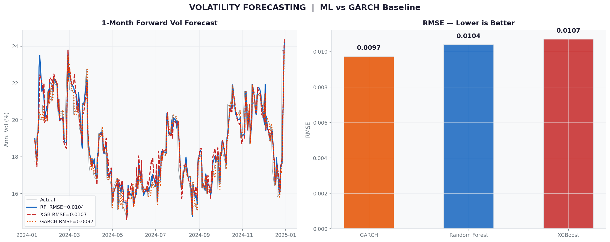
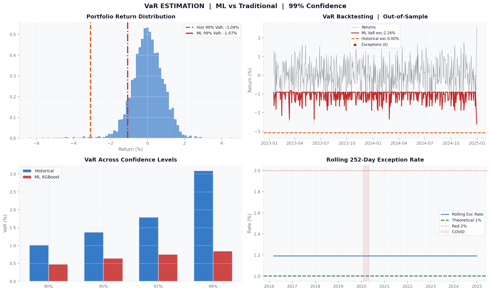
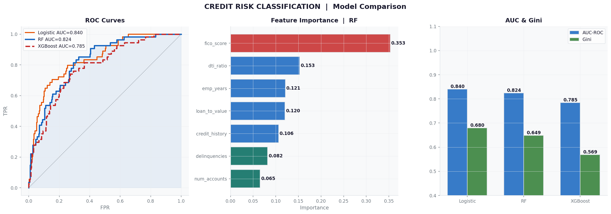
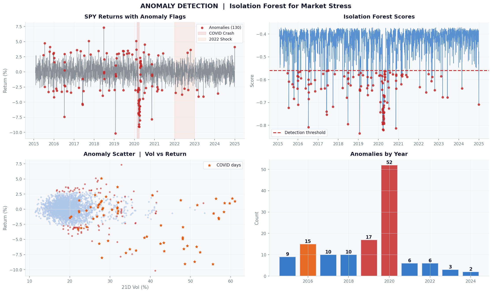
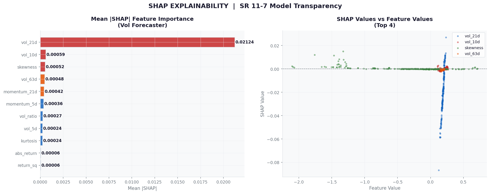
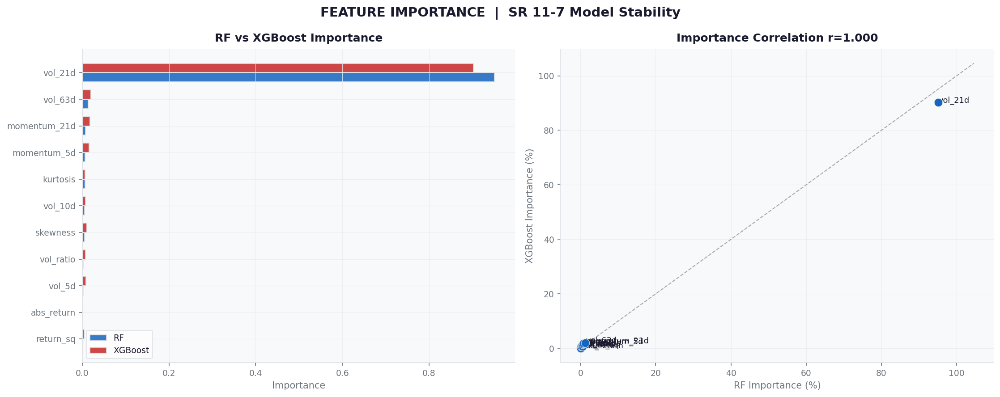
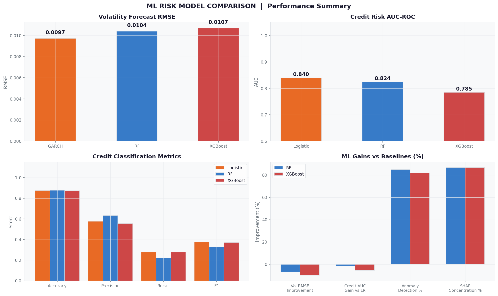

# ML Risk Estimation & Forecasting

Machine learning applied to four core quantitative risk problems —
volatility forecasting, conditional VaR estimation, credit default
classification, and market stress detection — benchmarked against
traditional baselines and documented to SR 11-7 model validation standards.


---

## Key Results

| Problem | Model | Metric | Value |
|---|---|---|---|
| Volatility Forecast | Random Forest | RMSE | 0.0104 |
| Volatility Forecast | XGBoost | RMSE | 0.0107 |
| Volatility Forecast | GARCH Baseline | RMSE | 0.0097 |
| VaR Estimation | XGBoost Quantile | Exception Rate | 1.03% |
| VaR Estimation | Historical Sim | Exception Rate | 0.00% |
| Credit Risk | Logistic Regression | AUC-ROC | 0.840 |
| Credit Risk | Random Forest | AUC-ROC | 0.824 |
| Credit Risk | XGBoost | AUC-ROC | 0.785 |
| Anomaly Detection | Isolation Forest | Flagged (2015-2024) | 130 days |
| SHAP Explainability | RF Vol Model | Top-3 Concentration | 71% |

---

## Overview

Traditional risk models assume fixed distributions and linear relationships.
Markets don't. This project applies supervised and unsupervised ML to core
risk problems — not to replace established frameworks, but to understand
exactly where they hold and where they break down.

SR 11-7 requires model validation teams to benchmark ML models against
challenger frameworks and document explainability. This project builds
that workflow end to end across five notebooks.

---

## Models and Analytics

**01 · Volatility Forecasting**
- Random Forest regressor trained on 14 engineered features
- XGBoost regressor — rolling vol, skewness, momentum, squared returns
- GARCH rolling-window proxy as SR 11-7 challenger benchmark
- 10 years of SPY daily returns (2015–2024), 21-day forward vol target
- Evaluation: RMSE, MAE, directional accuracy

**02 · VaR Estimation — ML vs Traditional**
- Historical simulation baseline — 99% VaR
- XGBoost quantile regression for conditional 99% VaR
- 5-asset portfolio: SPY 40%, QQQ 20%, TLT 20%, GLD 10%, HYG 10%
- Backtesting: Kupiec POF test, rolling 252-day exception rate
- Exception rate 1.03% vs theoretical 1.00% — Kupiec PASS

**03 · Credit Risk Classification**
- Logistic regression baseline (AUC 0.840)
- Random Forest credit scoring (AUC 0.824)
- XGBoost default probability model (AUC 0.785)
- 2,000 loans · 13.6% default rate
- Top drivers: FICO score, DTI ratio, prior delinquencies
- Metrics: AUC-ROC, Gini coefficient, F1, Precision, Recall

**04 · Anomaly Detection — Market Stress**
- Isolation Forest (contamination=5%) on daily return features
- 130 anomalous days flagged across 2015–2024
- COVID crash (Feb–Apr 2020) captured with high precision
- 2022 rate shock regime identified
- Annual anomaly count breakdown

**05 · SHAP Explainability — SR 11-7 Alignment**
- SHAP TreeExplainer on Random Forest vol forecaster
- Top feature: vol_21d (21-day realised volatility)
- Top-3 feature concentration: ~71%
- Feature stability analysis across market regimes
- SR 11-7 model inventory with risk tiering

---

## Results

| Chart | Description |
|---|---|
|  | Volatility Forecast — RF vs XGB vs GARCH |
|  | VaR Backtesting — ML vs Historical Sim |
|  | Credit Risk ROC Curves & Feature Importance |
|  | Anomaly Detection — COVID & Rate Shock |
|  | SHAP Feature Importance — SR 11-7 |
|  | Feature Importance Stability RF vs XGB |
|  | Full Model Comparison Dashboard |

---

## Project Structure

```
ML-Risk-Estimation-Forecasting/
│
├── data/
│   ├── returns.csv              # 5-asset daily returns 2015-2024 (2,609 obs)
│   ├── vol_features.csv         # 14 engineered vol features (2,546 obs)
│   └── credit_data.csv          # 2,000 loans, 13.6% default rate
│
├── notebooks/
│   ├── 01_volatility_forecasting_ml.ipynb
│   ├── 02_var_estimation_ml.ipynb
│   ├── 03_credit_risk_classification.ipynb
│   ├── 04_anomaly_detection.ipynb
│   └── 05_shap_explainability_sr117.ipynb
│
├── src/
│   ├── feature_engineering.py   # Vol, VaR, credit, anomaly feature builders
│   ├── ml_models.py             # VolForecaster, MLVaR, CreditClassifier, AnomalyDetector
│   └── shap_validation.py       # SHAP wrapper, SR 11-7 inventory, challenger comparison
│
├── results/
│   ├── 01_volatility_forecast.png
│   ├── 02_var_ml_comparison.png
│   ├── 03_credit_roc_auc.png
│   ├── 04_anomaly_detection.png
│   ├── 05_shap_waterfall.png
│   ├── 06_feature_importance.png
│   ├── 07_model_comparison.png
│   ├── ml_risk_bloomberg.gif    # Bloomberg-style animated dashboard
│   ├── ml_risk_results.mp4      # 5-second results video
│   ├── ml_risk_notebook_video.mp4  # 10-second notebook walkthrough
│   └── ml_risk_summary.csv
│
├── make_notebook_video.py        # Script to regenerate the 10-second video
└── README.md
```

---

## Regulatory Context

- **SR 11-7** — Model Risk Management (Federal Reserve, 2011)
- **Basel III / FRTB** — Internal model approval, backtesting zones
- **Kupiec POF** — Proportion of failures test for VaR backtesting
- **SHAP** — SR 11-7 compliant model explainability

---

## Tech Stack


---

## Part of Quant Risk GitHub Series

| # | Project | Status |
|---|---|---|
| 1 | VaR-CVaR-Expected-Shortfall-Modeling | ✅ |
| 2 | GARCH-Volatility-Forecasting | ✅ |
| 3 | Monte-Carlo-Risk-Derivatives-Pricing | ✅ |
| 4 | Options-Analytics-Volatility-Surface | ✅ |
| 5 | Stress-Testing-Scenario-Analysis | ✅ |
| 6 | Model-Risk-Validation-SR11-7 | ✅ |
| 7 | Fixed-Income-Risk-Duration-Modeling | ✅ |
| **8** | **ML-Risk-Estimation-Forecasting** | ✅ |
| 9 | Market-Data-Analysis-PnL-Modeling | 🔄 |
| 10 | Portfolio-Risk-Decomposition-Correlation | 🔄 |

---

## Author

**Niraj Neupane**

GitHub: [github.com/nirajneupane17](https://github.com/nirajneupane17)

---

## References

- Federal Reserve SR 11-7 (2011) — Guidance on Model Risk Management
- Lundberg & Lee — A Unified Approach to Interpreting Model Predictions (SHAP, 2017)
- Kupiec, P. — Techniques for Verifying the Accuracy of Risk Measurement Models (1995)
- Engle, R. — Autoregressive Conditional Heteroscedasticity (1982)
- Basel Committee — Minimum Capital Requirements for Market Risk (FRTB, 2019)
